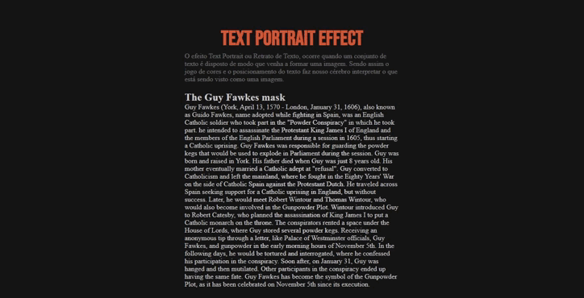

# Text-Portrait-Effect
O efeito Text Portrait ou Retrato de Texto, ocorre quando um conjunto de texto é disposto de modo que venha a formar uma imagem. 
Sendo assim o jogo de cores e o posicionamento do texto faz nosso cérebro interpretar o que está sendo visto como uma imagem.

